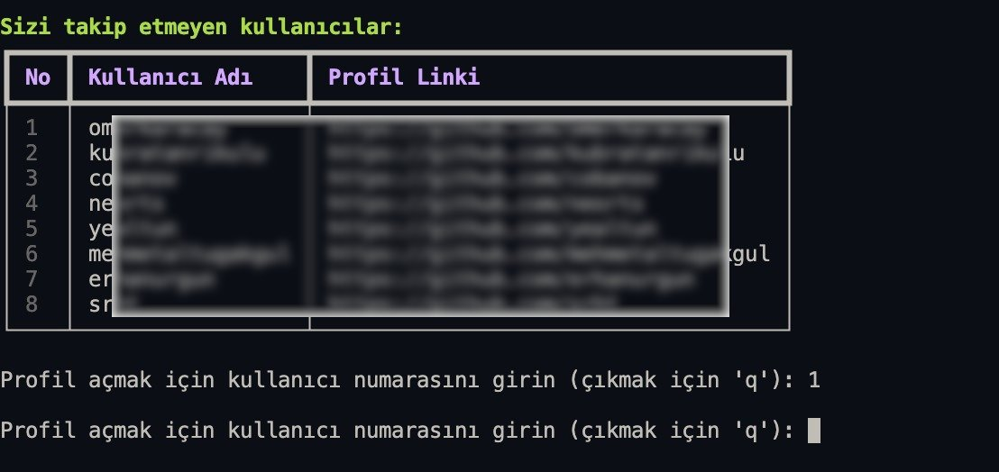

# Photos
Example              
:-------------------------:


# EN - GitHub Followers Analyzer

This project is a GitHub followers analyzer application developed using Python. It fetches and analyzes the followers of a specified GitHub user.

## Features

- **Fetches followers** of a specified GitHub user.
- **Analyzes the followers' data**.
- **Displays the analysis results** in a user-friendly format.

## Setup

To run the project locally, follow these steps:

1. Clone this repository:
    ```bash
    git clone https://github.com/kemalgundogdu/GitFollowAnalytics.git
    ```

2. Navigate to the project directory:
    ```bash
    cd GitFollowAnalytics
    ```

3. Create a virtual environment:
    ```bash
    python -m venv .venv
    ```

4. Activate the virtual environment:
    - On Windows:
        ```bash
        .venv\Scripts\activate
        ```
    - On macOS/Linux:
        ```bash
        source .venv/bin/activate
        ```

5. Install the required dependencies:
    ```bash
    pip install -r requirements.txt
    ```

6. Run the project:
    ```bash
    python main.py
    ```

## Technologies Used

- **Python**: For building the application.
- **PyGithub**: For interacting with the GitHub API.
- **rich**: For displaying data in a user-friendly format.

## Contributing

If you would like to contribute, please submit a pull request or open an issue.

## License

This project is licensed under the MIT License.

---

# TR - GitHub Takipçi Analiz Aracı

Bu proje, Python kullanılarak geliştirilmiş bir GitHub takipçi analiz aracıdır. Belirtilen bir GitHub kullanıcısının takipçilerini getirir ve analiz eder.

## Özellikler

- **Belirtilen bir GitHub kullanıcısının takipçilerini getirir**.
- **Takipçilerin verilerini analiz eder**.
- **Analiz sonuçlarını kullanıcı dostu bir formatta gösterir**.

## Kurulum

Projeyi yerel ortamınızda çalıştırmak için aşağıdaki adımları izleyin:

1. Bu depoyu klonlayın:
    ```bash
    git clone https://github.com/kemalgundogdu/GitFollowAnalytics.git
    ```

2. Proje dizinine gidin:
    ```bash
    cd GitFollowAnalytics
    ```

3. Bir sanal ortam oluşturun:
    ```bash
    python -m venv .venv
    ```

4. Sanal ortamı etkinleştirin:
    - Windows'ta:
        ```bash
        .venv\Scripts\activate
        ```
    - macOS/Linux'ta:
        ```bash
        source .venv/bin/activate
        ```

5. Gerekli bağımlılıkları yükleyin:
    ```bash
    pip install -r requirements.txt
    ```

6. Projeyi çalıştırın:
    ```bash
    python main.py
    ```

## Kullanılan Teknolojiler

- **Python**: Uygulamayı oluşturmak için.
- **PyGithub**: GitHub API ile etkileşim kurmak için.
- **rich**: Verileri kullanıcı dostu bir formatta göstermek için.

## Katkıda Bulunma

Katkıda bulunmak isterseniz, lütfen bir pull request gönderin veya bir issue açın.

## Lisans

Bu proje MIT Lisansı ile lisanslanmıştır.
